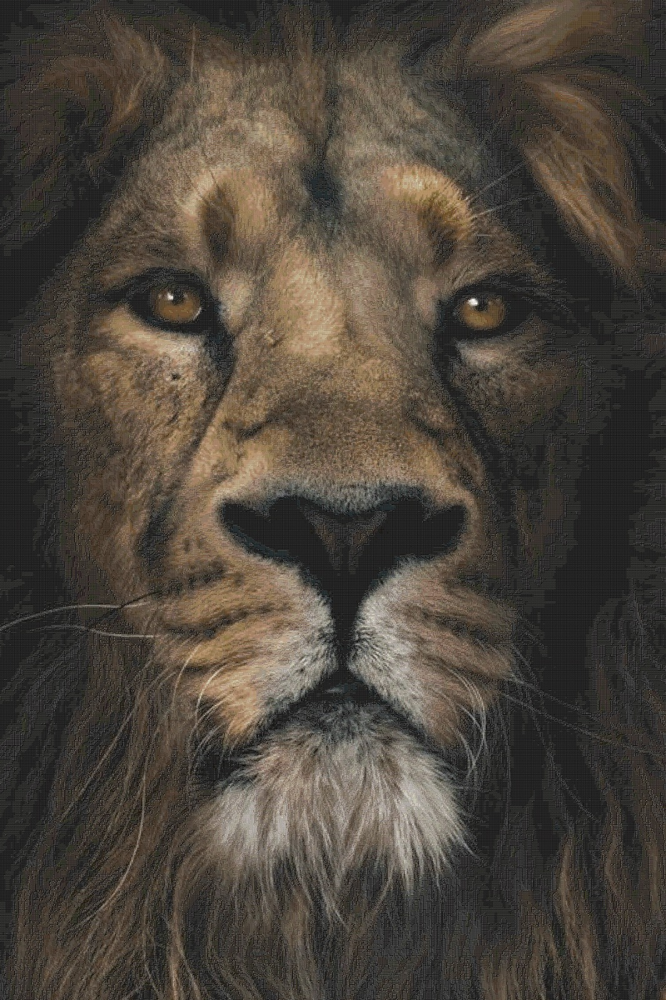
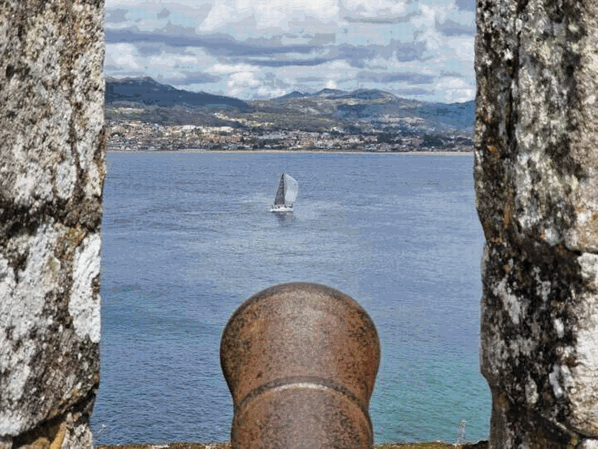
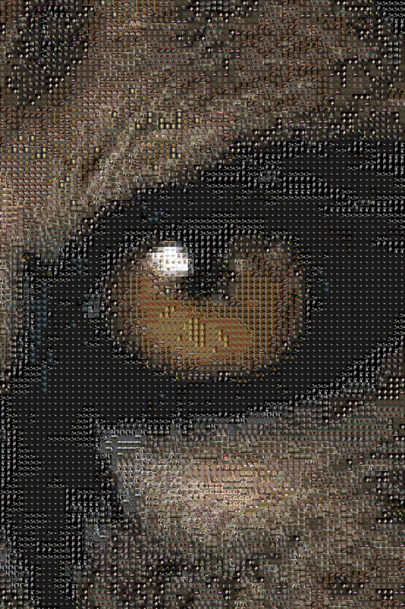
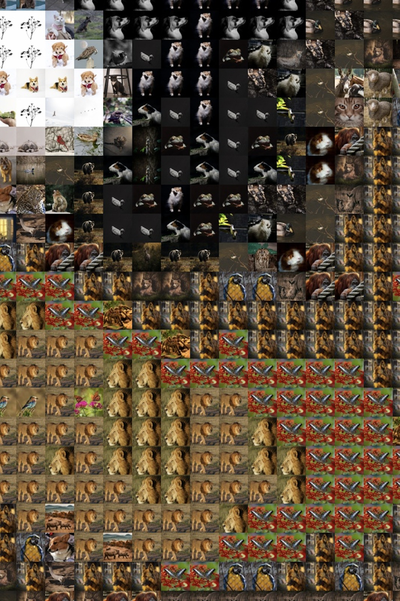

# Photomosaic Creator

## Index
- [Introduction](#introduction)
- [Results](#results)
- [Run the script](#run-the-script)
- [How it works](#how-it-works)
  - [Main function (create_img)](#main-function-create_img)
    - [Arguments](#arguments-create_img)
    - [Examples](#examples-create_img)
  - [get_best()](#function-get_best)
    - [Description](#description)
    - [Arguments](#arguments-get_best)
    - [Examples](#examples-get_best)
  - [get_best_for_main()](#function-get_best_for_main)
    - [Description](#description-get_best_for_main)
    - [Arguments](#arguments-get_best_for_main)
    - [Examples](#examples-get_best_for_main)
  - [remove_duplicates()](#function-remove_duplicates)
    - [Description](#description)
    - [Arguments](#arguments-remove_duplicates)
    - [Examples](#examples-remove_duplicates)
  - [resize_images()](#function-resize_images)
    - [Description](#description)
    - [Arguments](#arguments-resize_images)
    - [Examples](#examples-resize_images)
- [Possible errors](#possible-errors)

## Introduction
This program allows you to create a photomosaic from a set of images.

The image and the set of images can be any size you want, but the more size, the more time it will take and the larger the resulting image will be.

You can use the preset sets/folders of images or you can upload your own folders to the `images` folder.

The more images the set has, the better the result, but the more time it will take to create the photomosaic.

## Results

### Full images



### Zoom



## Run the script

Open the terminal, go to this folder and type:
```bash
$ python3 main.py
```

## How it works

1. Creates the needed folders
2. If `num_images` is specified, the function `get_best_for_main` will be called and the images obtained with it will be used to create the photomosaic.
3. Obtains the average value of each primary color of each image in the selected folder by reducing the size of each image to 1 pixel
4. Creates an array with all the numpy arrays of the images in the folder, resized to the desired size and converted from BGR to RGB
5. Creates a numpy array from the selected main image in the `main-images` folder
6. Creates the photomosaic by replacing each pixel of the main image with the images with the closest average color
7. Saves the photomosaic in the `output` folder

### Main function (create_img())

#### Arguments (create_img)
| argument | description | example | default value | Range |
| -------- | ----------- | ------- | ------------- | ----- |
| 1 | Name of the main image | "img1.jpeg" | |
| 2 | Size in px of the images that make up the main image | 100 | 50 | [1,...] |
| images_folder | Folder where the set of images are | images_folder="animals" | "animals" | |
| new_name | Name of the new image | new_name="my_photomosaic.jpg" | "photomosaic.jpg" | |
| num_images | Number of images that will be used to create the image. If not specified, it will be create will all the iamges in the images_folder | 20 | 50 | [3,num_images] |

#### Examples (create_img)
```python
# Suggested
create_img( 
  main_image=     "canon-h.jpeg", 
  images_size=    50, 
  images_folder=  "best_animals",
  new_name=       "photomosaic.jpg",
  num_images=     100
)
```


### Function: get_best()

#### Description

Function that picks the best images from the given set of images.

#### Arguments (get_best)

| argument | description | example | default value | Range |
| -------- | ----------- | ------- | ------------- | ----- |
| folder | Folder of the set of images | "landscapes" | "animals" | |
| max_color_deviation | The maximum average color deviation from the average color in the images. So that there are not many images with, for example, a green half and a black half | 150 | 765 | [0,765] |
| max_contrast | The maximum contrast between the top-bottom or right-left that an image can have | 150 | 765 | [0,765] |

#### Examples (get_best)
```python
# Suggested:
get_best(
  folder=                 "animals",
  max_avg_color_deviation=100,
  max_contrast=           100
)
```


### Function: get_best_for_main()

#### Description (get_best_for_main)

Creates a new folder with the best images to be used as a palette for a main image

#### Arguments (get_best_for_main)

| argument | description | example | default value | Range |
| -------- | ----------- | ------- | ------------- | ----- |
| main_image | Path of the main image from where the color palette will be created | img2_high-res.jpeg | | |
| folder | Folder of the set of images | "landscapes" | "animals" | |
| num_images | Number of images to pick | 10 | 20 | [3,num_images] |

#### Examples
```python
get_best_for_main(
    main_image=  "img2_high-res.jpeg",
    folder=      "animals",
    num_images=  20
)
```


### Function: remove_duplicates()

#### Description (remove_duplicates)

Function that removes the duplicate images from the given folder.

#### Arguments (remove_duplicates)

| argument | description | example | default value |
| -------- | ----------- | ------- | ------------- |
| folder | Folder of the set of images | "landscapes" | "animals" |

#### Examples (remove_duplicates)
```python
remove_duplicates("animals")
remove_duplicates("landscapes")
```


### Function: resize_images()

#### Description (resize_images)

Function that resizes the images in the given folder to the given size.

#### Arguments (resize_images)

| argument | description | example | default value | Range |
| -------- | ----------- | ------- | ------------- | ----- |
| folder | Folder with the images to resize | "images/landscapes" | "images/animals" | |
| size | Size of the images. It's ust a number, since the set of images has to be squared | 500 | 1000 | [1,...] |

#### Examples (resize_images)
```python
resize_images(
  folder= "images/animals",
  size=   1000,
)
```

## Possible errors

If you get the error: `zsh: killed python3 main.py`, it means that the program is taking too much memory.

To solve it, you can try to reduce the size of the resized images or of the main image.


### Function: treat_images()

#### Description (treat_images)

Resizes files from a folder and removes duplicates

#### Arguments (treat_images)

| argument | description | example | default value | Range |
| -------- | ----------- | ------- | ------------- | ----- |
| folder | Folder with the images | "images/landscapes" | "images/animals" | |
| size | Size that the new images will have | 500 | 1000 | [1,...] |

#### Examples (treat_images)
```python
treat_images(
  folder=         "images/animals",
  size=           1000,
)
treat_images()
```

### Function: create_main_folder()

#### Description (create_main_folder)

Creates a folder with all the other images from the other folders

#### Arguments (create_main_folder)

| argument | description | example | default value | Range |
| -------- | ----------- | ------- | ------------- | ----- |
| size | Size that the new images will have | 200 | 200 | [1,...] |

#### Examples (create_main_folder)
```python
create_main_folder()
create_main_folder(
  size=500
)
```


## Possible errors

If you get the error: `zsh: killed python3 main.py`, it means that the program is taking too much memory.

To solve it, you can try to reduce the size of the resized images or of the main image.