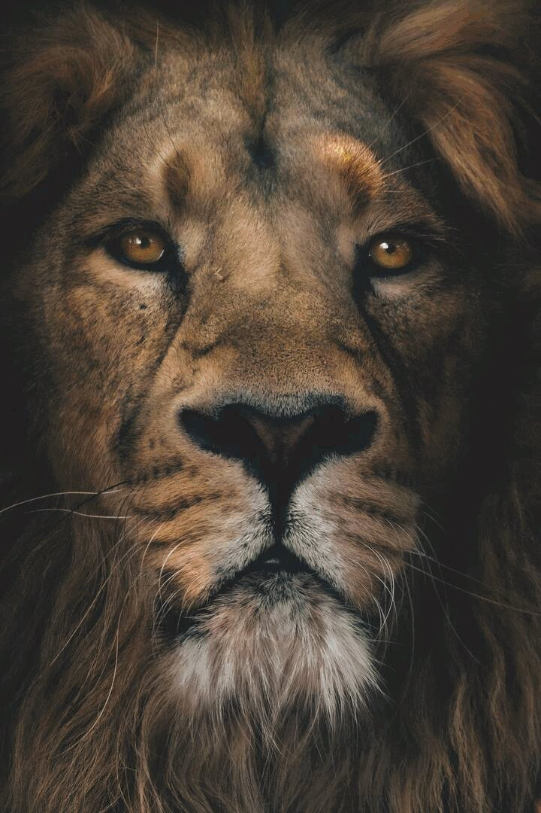
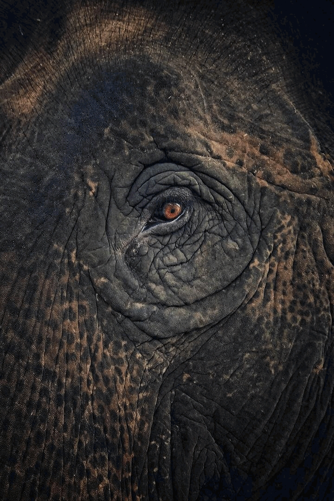
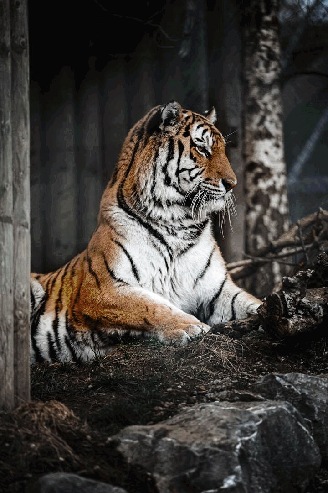

# Photomosaic Creator

## Index
- [Install needed packages](#install-needed-packages)
- [Introduction](#1-introduction)
- [Results](#2-results)
- [Run the script](#3-run-the-script)
- [How it works](#4-how-it-works)
  - [`create_photomosaic`](#create_photomosaic)
  - [`get_best`](#get_best)
  - [`treat_images`](#treat_images)
  - [`treat_all_images`](#treat_all_images)
  - [`create_all_folder`](#create_all_folder)
  - [`clean_best_folders`](#clean_best_folders)
- [Possible errors](#5-possible-errors)


## Install needed packages
```bash
pip3 install -r requirements.txt
```


## 1. Introduction
This program allows you to create a photomosaic from a set of images.

You can use the preset sets/folders of images or you can upload your own folders to the `images` folder.


## 2. Results

<div float="left">
    
    
    
</div>
<br>

https://user-images.githubusercontent.com/65092569/192170512-0378d30a-4094-4029-a875-1a368e5f948f.mp4

https://user-images.githubusercontent.com/65092569/192170360-5c9a6985-58ad-49c1-874d-ea90fc1c0b42.mp4

https://user-images.githubusercontent.com/65092569/192170517-4b6492ba-2d95-46fa-a4da-5bc9dc64b833.mp4


## 3. Run the script
Call the desired functions in this part of the `main.py` file:
```python
#########################################################################################
startTime = time.time()
#########################################################################################
# Your calls go here

create_photomosaic( 
    main_image= "lion-h.jpg", 
    images_folder= "$b_$all",
    new_name= "photomosaic",
    num_images= False,
    save_fullres= False,
    save_lowres= True,
    save_gif= False,
    save_gif_reversed= True,
    save_vid= False,
    save_vid_reversed= True,
    save_zooms= False,
    resize_main= False,
    images_size= 50,
    quality= 85,
    max_zoomed_images= 5,
    zoom_incr= 1.02,
    frame_duration= 30
)
#########################################################################################
print(f'{Fore.CYAN}Done in: {round(time.time() - startTime,4)}s{Fore.RESET}')
#########################################################################################
```

Open the terminal, go to this path and type:
```bash
python3 main.py
```

Then, after the script runs, the result should appear in the `output` folder.


## 4. How it works

### `create_photomosaic`

Creates a photomosaic from a set of images

#### Arguments
| Argument | Description | Default | Example | Range |
| -------- | ----------- | ------- | ------- | ----- |
| main_image | Filename of the main image, save on the `main-images` folder | `lion-h` | `elephant-h.jpg` ||
| images_size | Size of the images to be used in the photomosaic | `50` | `100` ||
| images_folder | Folder inside the `images` folder to be used as a set of images | `$b_$all` | `animals` ||
| new_name | Name of the new image and folder | `photomosaic` | `lion` ||
| num_images | Number of images to be used to create the photomosaic | `False` | `255` | [3,255] |
| quality | Quality of the new images | `85` | `75` | [0,100] |
| save_fullres | Save the photomosaic in the full resolution | `False` | `True` ||
| save_lowres | Save the photomosaic in the same resolution as the main image | `True` | `False` ||
| save_gif | Save the photomosaic as a GIF, created by zooming **into** the photomosaic | `False` | `True` ||
| save_gif_reversed | Save the photomosaic as a GIF, created by zooming **out** the photomosaic | `False` | `True` ||
| save_vid | Save the photomosaic as a vid, created by zooming **into** the photomosaic | `True` | `False` ||
| save_vid_reversed | Save the photomosaic as a vid, created by zooming **out** of the photomosaic | `True` | `False` ||
| save_zooms | Save zoomed images of the photomosaic | `False` | `True` ||
| resize_main | Resize the main image (If you have an image too big to process) | `False` | `(720, 540)` | [1,...] |
| max_zoomed_images | Maximum number of images the final zoomed image will have | `10` | `5` | [1,...] |
| zoom_incr | Increment of the zoom in each frame | `1.05` | `1.015` | [1,...] |
| frame_duration | Duration of each frame of the GIF/video, in milliseconds | `30` | `15` | [1,...] |

#### Explanation
1. Creates the needed folders
2. If `resize_main != False`, resizes the `main_image` to `resize_main`, a tuple with the width and the height.
3. If `num_images != False`, it will obtain the best images to create the photomosaic, based on the palette of colors of the main image.
4. Sorts the files in the `images_folder` folder
5. Gets the average color of each image in the `images_folder` folder
6. Creates a list with all the numpy arrays of the images in the `images_folder` folder, resized to `images_size`
7. Creates an empty numpy array (`new_img_arr`) with the size of the main image multiplied by `images_size`
8. For each pixel in the `main_image` array, it will add to the `new_img_arr` the image whose average color matches best with the pixel's color
9. Creates a folder to store the created images, with the name `new_name`
10. Saves the result in the `output` folder with quality `quality`:
    - If `save_fullres == True`, it will save the photomosaic in the full resolution
    - If `save_lowres == True`, it will save the photomosaic in the same resolution as the main image
    - If `save_zooms == True`, it will save zoomed images of the photomosaic
    - If `save_gif == True`, it will save the photomosaic as a GIF, created by zooming **into** the photomosaic
    - If `save_gif_reversed == True`, it will save the photomosaic as a GIF, created by zooming **out** the photomosaic
    - If `save_vid == True` or, it will save the photomosaic as a video, created by zooming **into** the photomosaic
    - If `save_vid_reversed == True`, it will save the photomosaic as a video, created by zooming **out** of the photomosaic

#### Examples
```python
# Default
create_photomosaic( 
    main_image= "lion-h.jpg", 
    images_folder= "$b_$all",
    new_name= "photomosaic",
    num_images= False,
    save_fullres= False,
    save_lowres= True,
    save_gif= False,
    save_gif_reversed= True,
    save_vid= False,
    save_vid_reversed= True,
    save_zooms= False,
    resize_main= False,
    images_size= 50,
    quality= 85,
    max_zoomed_images= 5,
    zoom_incr= 1.02,
    frame_duration= 30
)

create_photomosaic( 
    main_image= "elephant-h.jpg", 
    images_size= 50,
    images_folder= "$b_animals",
    new_name= "elephant",
    num_images= 255,
    save_zooms= True,
)

create_photomosaic( 
    main_image= "tiger-m.jpg", 
    images_size= 50,
    new_name= "tiger",
)
```


### `get_best`

Gets the best images from the `folder` folder

#### Arguments

| Argument | Description | Default | Example | Range |
| -------- | ----------- | ------- | ------- | ----- |
| folder | Folder inside the `images` folder to be used | `$all` | `animals` || 
| max_avg_color_deviation | Maximum average of the deviations from every pixel from the image's average color | `765` | `120` | [0,765] |
| max_contrast | Maximum contrast between the image's top and bottom and left and right parts | `765` | `150` | [0,765] |
| size | Size that the images of the new folder will have. The less size, the less it will take to create a photomosaic with these images | `1000` | `200` | [1,...] |

#### Explanation

1. Creates a new folder inside the `images` folder, with the name of the `folder` argument preceded by `$b_`
2. Sorts the files in the `folder` folder
3. Gets the average color of each image in the `folder` folder
4. Checks each image in the `folder` folder. If it meets the requirements (`check_contrasts(...) == True` and `check_color_deviation(...) == True`), it will be added to the new folder: 

#### Examples

```python
# Default
get_best(
    folder= "$all",
    max_avg_color_deviation= 765,
    max_contrast= 765,
    size= 1000
)

get_best(
    folder= "animals",
    max_avg_color_deviation= 120,
    max_contrast= 150,
    size= 200
)
```


### `treat_all_images`

#### Arguments

| Argument | Description | Default | Example | Range |
| -------- | ----------- | ------- | ------- | ----- |
| size | Size that the treated images of all the folders will have | `1000` | `500` | [1,...] |

#### Explanation

Resizes and eliminates duplicates from every folder

#### Examples

```python
# Default
treat_all_images(
    size= 1000
)
```


### `create_all_folder`

#### Arguments

| Argument | Description | Default | Example | Range |
| -------- | ----------- | ------- | ------- | ----- |
| size | Size that the images of the new folder will have | `200` | `100` | [1,...] |

#### Explanation

Creates a new folder called `$all` inside the `images` folder, with all the images of the folders (not including the "best folders" (that start with `$b_`)) inside the `images` folder

#### Examples

```python
# Default
create_all_folder(
    size= 200
)

create_all_folder(
    size= 100
)
```


### `clean_best_folders`

#### Explanation

Deletes the best folders (the ones that start with `$b_`)

#### Examples

```python
clean_best_folders()
```


## 5. Possible errors
If you get the error: `zsh: killed python3 main.py`, it means that the program is taking too much memory.

To solve it, you can try to reduce the `images_size` in [`create_photomosaic`](#create_photomosaic) or the size of the `main_image`.