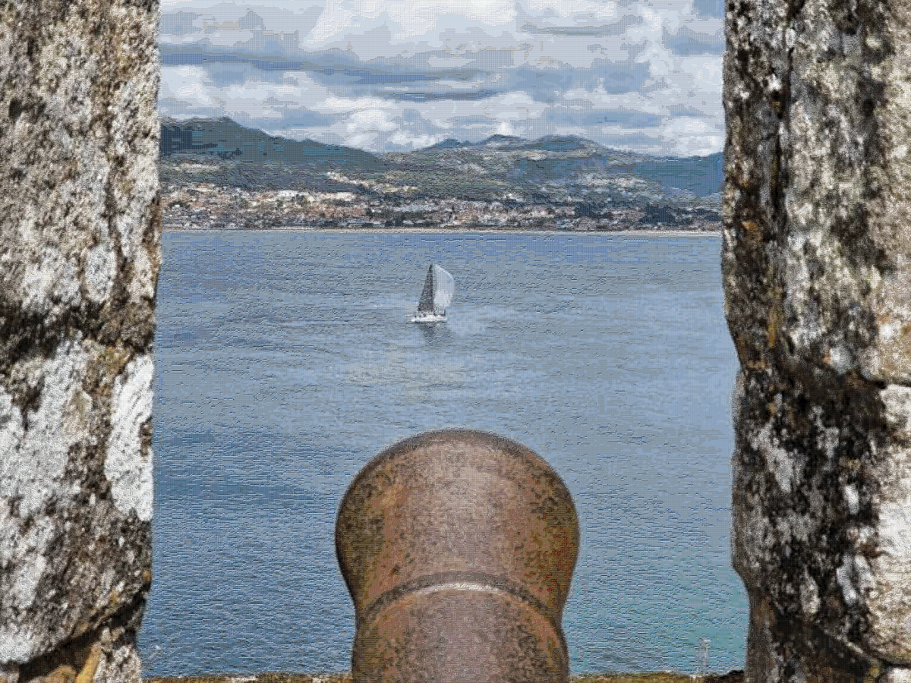
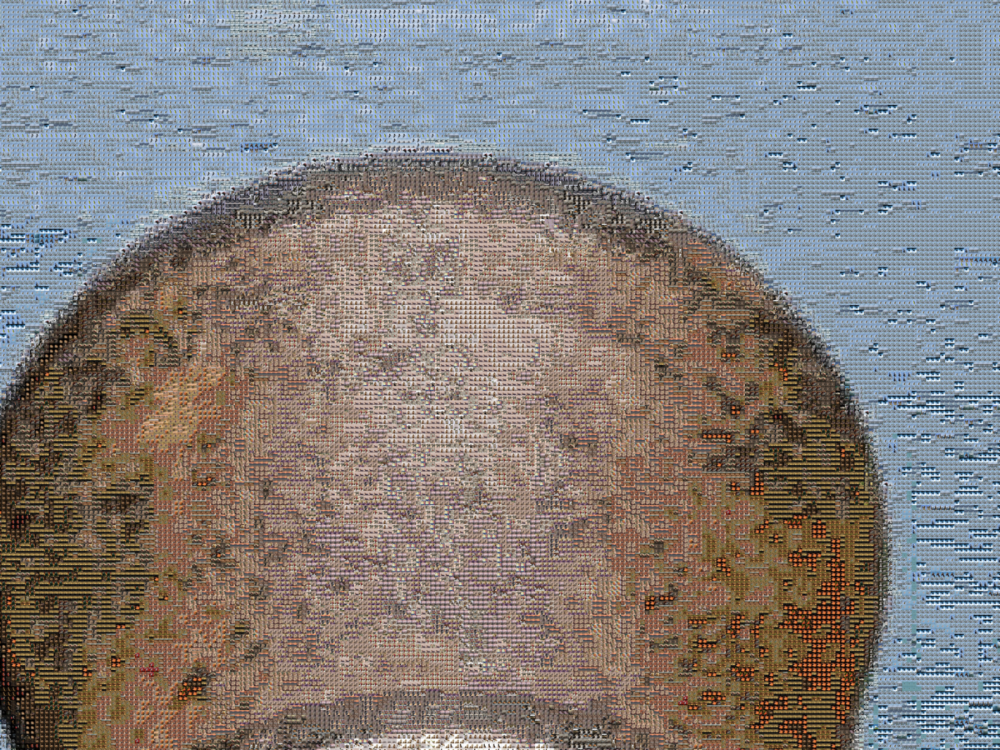
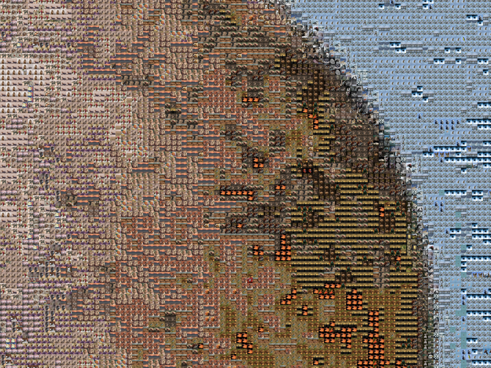
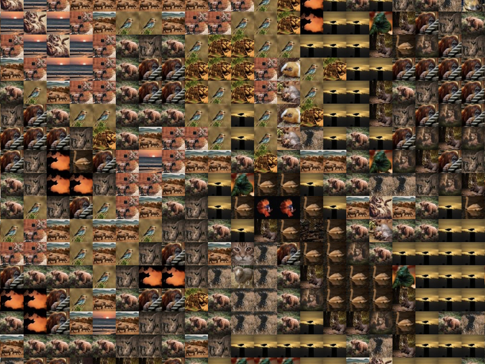

# Photomosaic Creator

## Index
- [Index](#index)
- [Introduction](#introduction)
  - [Main function (create_img)](#main-function-create_img)
    - [Arguments (create_img)](#arguments-create_img)
    - [Examples (create_img)](#examples-create_img)
- [Possible errors](#possible-errors)

## Introduction
This program allows you to create a photomosaic from a set of images.

The image and the set of images can be any size you want, but the more size, the more time it will take and the larger the resulting image will be.

You can use the preset sets/folders of images or you can upload your own folders to the `images` folder.

The more images the set has, the better the result, but the more time it will take to create the photomosaic.

## Results






## Run the script

```bash
$ python3 main.py
```

## How it works

1. Creates the needed folders
2. If `resize=True`, the `resized` folder will be replaced with the new resized images from the given set of images
3. Obtains the average value of each primary color of each image in the `resized` folder by reducing the size of each image to 1 pixel
4. Creates an array with all the numpy arrays of the images in the `resized` folder, converted from BGR to RGB
5. Creates a numpy array from the selected main image in the `main-images` folder
6. Creates the photomosaic by choosing the images with the closest average color for each pixel in the main image
7. Saves the photomosaic in the `output` folder

### Main function (create_img)

#### Arguments (create_img)
| argument | description | example | default value | Required |
| -------- | ----------- | ------- | ------------- | -------- |
| 1 | Name of the main image | "my_img.jpeg" | | Yes |
| 2 | Size in px of the images that make up the main image | 50 | | Yes |
| resize | Whether or not you want to resize the images | resize=True | False | No |
| images_folder | Folder where the images are | images_folder="animals" | "animals" | No |
| new_name | Name of the new image | new_name="photomosaic.jpg" | "photomosaic.jpg" | No |

#### Examples (create_img)
```python
create_img( 
  "img1.jpeg", 
  100
)
create_img( 
  "img1_high-res.jpeg",
  50
)
create_img( 
  "other_image.png", 
  75, 
  images_folder="landscapes"
)
create_img( 
    "other_image.jpg", 
    50, 
    resize=True, 
    images_folder="other_folder", 
    new_name="my_new_photomosaic.png"
)
create_img( 
    "other_image.jpeg", 
    50, 
    new_name="my_new_photomosaic.jpeg", 
    resize=True
)
```

## Possible errors

If you get the error: `zsh: killed python3 main.py`, it means that the program is taking too long to run (it's taking too much memory).

To solve it, you can try to reduce the size of the resized images or of the main image.